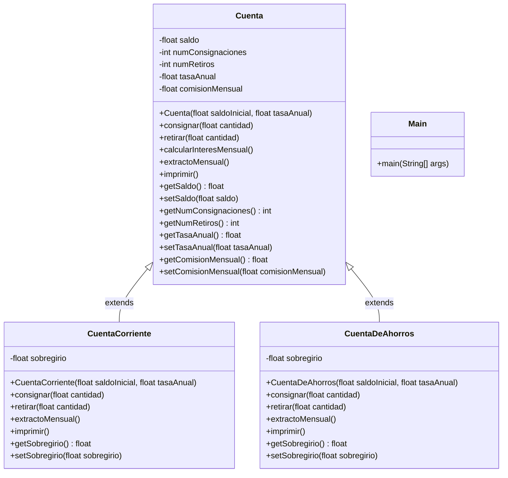

# Tareaprogramacion

## Diagrama de Clases

```mermaid
classDiagram
    class Cuenta {
        -float saldo
        -int numConsignaciones
        -int numRetiros
        -float tasaAnual
        -float comisionMensual
        +Cuenta(float saldoInicial, float tasaAnual)
        +consignar(float cantidad)
        +retirar(float cantidad)
        +calcularInteresMensual()
        +extractoMensual()
        +imprimir()
        +getSaldo() float
        +setSaldo(float saldo)
        +getNumConsignaciones() int
        +getNumRetiros() int
        +getTasaAnual() float
        +setTasaAnual(float tasaAnual)
        +getComisionMensual() float
        +setComisionMensual(float comisionMensual)
    }

    class CuentaCorriente {
        -float sobregirio
        +CuentaCorriente(float saldoInicial, float tasaAnual)
        +consignar(float cantidad)
        +retirar(float cantidad)
        +extractoMensual()
        +imprimir()
        +getSobregirio() float
        +setSobregirio(float sobregirio)
    }

    class CuentaDeAhorros {
        -float sobregirio
        +CuentaDeAhorros(float saldoInicial, float tasaAnual)
        +consignar(float cantidad)
        +retirar(float cantidad)
        +extractoMensual()
        +imprimir()
        +getSobregirio() float
        +setSobregirio(float sobregirio)
    }

    class Main {
        +main(String[] args)
    }

    Cuenta <|-- CuentaCorriente : extends
    Cuenta <|-- CuentaDeAhorros : extends
```